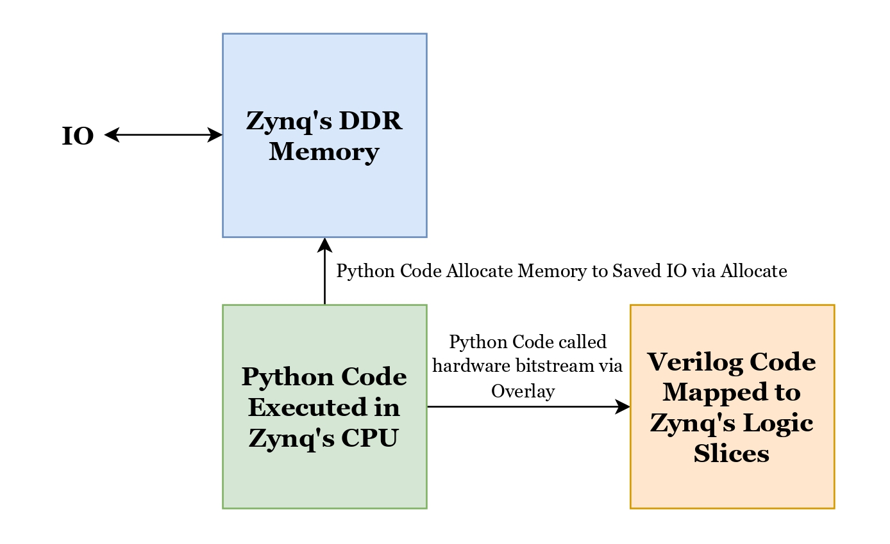

# Network Intrusion Detection System Variational Autoencoder (NIDS-VAE)
This project is intended as preparation for 2025 LSI Design Contest in Okinawa. Therefore, the variational autoencoder model complies with the guidelines of the LSI Design Contest provided in the following link : http://www.lsi-contest.com/shiyou_4e.html.

## Table of Contents
- [About the Project](#About-the-Project)
- [A Brief About NIDS and The Dataset](#A-Brief-About-NIDS-and-The-Dataset)
- [Architecture of NIDS-VAE](#Architecture-of-NIDS-VAE)
- [Usage](#usage)
- [License](#license)

## About the Project
**NIDS-VAE** presents a **software-controlled hardware accelerator** implemented on a Zynq-7000 FPGA platform. The hardware architecture, including the Variational Autoencoder (VAE), is developed at the register-transfer level (RTL) and synthesized using Xilinx Vivado. The Zynq-7000 device integrates an ARM processor capable of running a Python kernel, which is utilized to perform data preprocessing and control the execution of hardware modules via FPGA overlays. This approach enables seamless integration between high-level software flow and low-level hardware acceleration, facilitating efficient deployment of machine learning models on reconfigurable systems.

## A Brief About NIDS and The Dataset
### What is NIDS ?
Network Intrusion Detection Systems (NIDS) play a crucial role in identifying threats by analyzing network traffic patterns. There's two approach to do NIDS :

| No | Approach | Description | Advantage | Limitation |
|----| -------- | ----------- | --------- | ---------- |
| 1  | Misuse Detection | Detects known attacks by matching network traffic patterns with predefined attack signatures | Accurate in identifying well-documented attacks | Unable to detect new (zero-day) attacks that do not yet have signatures |
| 2  | Anomaly Detection | Detects new attacks by identifying deviations from normal traffic patterns | Capable of detecting previously unseen (zero-day) attacks | Defining "normal" behavior accurately is challenging, which often leads to high false alarm rates (e.g., legitimate traffic being flagged as an attack)|

### Dataset and Motivation of this Project
I use the CIC-IDS-2017 dataset. For more detailed information, please refer to: https://www.unb.ca/cic/datasets/ids-2017.html. Here, I will only discuss the most relevant aspects. 

The data was collected by simulating network traffic activities. Under normal conditions, no suspicious activity occurs—this is referred to as **benign**. At specific times, cyberattacks were intentionally executed against the network to generate malicious traffic. The CIC-IDS-2017 dataset extracts more than 80 network flow features from the simulated traffic. This allows us to observe the differences in network flow feaures between benign and attack conditions. **NIDS-VAE is then used to perform anomaly detection on this dataset to determine whether a network traffic instance is normal or potentially indicates a cyberattack**.

## Architecture of NIDS-VAE 

### Neural Network Architecture
NIDS-VAE aims to **perform anomaly detection by classifying network traffic as either normal or malicious**, analogous to binary classification between healthy and infected conditions. To achieve this, we combine the AE and VAE architectures, as illustrated in the figure below.

  

The input fed into the VAE consists of integers ranging from 0 to 1.
The VAE is trained to reconstruct the input such that benign data is mapped to 0, while traffic associated with cyberattacks is reconstructed as 1. Then, the AE decore will act as classifier to determine wether the data is normal or malicious.

### Software - Hardware Interaction
The Python script act as an controller and is executed on the Python kernel running on the ARM Cortex-A9 CPU of the Zynq-7000 FPGA. The PYNQ library is utilized to access FPGA hardware components such as DDR memory and logic slices. The script performs the following tasks:
- Preprocesses raw datasets into a format suitable for processing by the NIDS-VAE.
- Stores input and output data in the DDR memory of the Zynq FPGA.
- Sends input data to the FPGA logic slices via an Overlay. The input from DDR memory must pass through several communication protocols : the AMBA Bus, the AXI Interconnect, and lastly AXI DMA, before reaching the implemented Verilog logic.
- Stores the resulting output back into the DDR memory.

The picture below gives simple ilustration about the software-hardware interaction:

  

To see the details about the verilog architecture, you can see all the images start with "rtl" in images directory. 

## Repo Structure 
